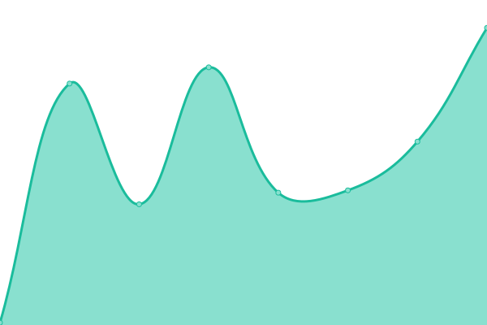

# [📈 Live Status](https://TebbaaX.github.io/DownTime-Score): <!--live status--> **🟩 All systems operational**

<!--start: status pages-->
<!-- This summary is generated by Upptime (https://github.com/upptime/upptime) -->
<!-- Do not edit this manually, your changes will be overwritten -->
<!-- prettier-ignore -->
| URL | Status | History | Response Time | Uptime |
| --- | ------ | ------- | ------------- | ------ |
|  [CNSS](https://www.cnss.ma) | 🟩 Up | [cnss.yml](https://github.com/adnane-X-tebbaa/DownTime-Score/commits/HEAD/history/cnss.yml) | 

 7863ms
     
 | 

<a href="https://TebbaaX.github.io/DownTime-Score/history/cnss">100.00%</a>
    

|  [TebbaaX](https://www.TebbaaX.com) | 🟩 Up | [tebbaa-x.yml](https://github.com/adnane-X-tebbaa/DownTime-Score/commits/HEAD/history/tebbaa-x.yml) | 

 110ms
     
 | 

<a href="https://TebbaaX.github.io/DownTime-Score/history/tebbaa-x">100.00%</a>
    

|  [Google](https://www.google.com) | 🟩 Up | [google.yml](https://github.com/adnane-X-tebbaa/DownTime-Score/commits/HEAD/history/google.yml) | 

 60ms
     
 | 

<a href="https://TebbaaX.github.io/DownTime-Score/history/google">100.00%</a>
    

<!--end: status pages-->

## 📄 License

- Code: [MIT](./LICENSE) © [TebbaaX](https://www.TebbaaX.com)
- Data in the `./history` directory: [Open Database License](https://opendatacommons.org/licenses/odbl/1-0/)
