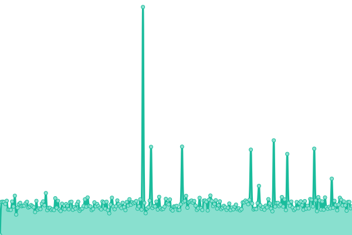
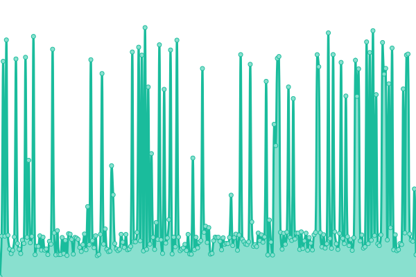

# [📈 Live Status](https://TebbaaX.github.io/DownTime-Score): <!--live status--> **🟧 Partial outage**

<!--start: status pages-->
<!-- This summary is generated by Upptime (https://github.com/upptime/upptime) -->
<!-- Do not edit this manually, your changes will be overwritten -->
<!-- prettier-ignore -->
| URL | Status | History | Response Time | Uptime |
| --- | ------ | ------- | ------------- | ------ |
|  [Covid Portal](http://covid19.interieur.gov.ma/Operation_ATTADAMON.aspx) | 🟥 Down | [covid-portal.yml](https://github.com/adnane-X-tebbaa/DownTime-Score/commits/HEAD/history/covid-portal.yml) | 

 0ms
     
 | 

<a href="https://TebbaaX.github.io/DownTime-Score/history/covid-portal">100.00%</a>
    

|  [Health Portal](https://www.sante.gov.ma/Pages/Accueil.aspx) | 🟩 Up | [health-portal.yml](https://github.com/adnane-X-tebbaa/DownTime-Score/commits/HEAD/history/health-portal.yml) | 

 2109ms
     
 | 

<a href="https://TebbaaX.github.io/DownTime-Score/history/health-portal">100.00%</a>
    

|  [CNSS](https://www.cnss.ma) | 🟩 Up | [cnss.yml](https://github.com/adnane-X-tebbaa/DownTime-Score/commits/HEAD/history/cnss.yml) | 

 2267ms
     
 | 

<a href="https://TebbaaX.github.io/DownTime-Score/history/cnss">100.00%</a>
    

|  [Data](http://data.gov.ma) | 🟩 Up | [data.yml](https://github.com/adnane-X-tebbaa/DownTime-Score/commits/HEAD/history/data.yml) | 

 1515ms
     
 | 

<a href="https://TebbaaX.github.io/DownTime-Score/history/data">100.00%</a>
    

|  [Douanes](http://www.douane.gov.ma) | 🟩 Up | [douanes.yml](https://github.com/adnane-X-tebbaa/DownTime-Score/commits/HEAD/history/douanes.yml) | 

 1300ms
     
 | 

<a href="https://TebbaaX.github.io/DownTime-Score/history/douanes">100.00%</a>
    

|  [Massar Website](https://massar.men.gov.ma) | 🟩 Up | [massar-website.yml](https://github.com/adnane-X-tebbaa/DownTime-Score/commits/HEAD/history/massar-website.yml) | 

 1310ms
     
 | 

<a href="https://TebbaaX.github.io/DownTime-Score/history/massar-website">100.00%</a>
    

|  [Massar Login](https://massarservice.men.gov.ma/moutamadris/Account) | 🟩 Up | [massar-login.yml](https://github.com/adnane-X-tebbaa/DownTime-Score/commits/HEAD/history/massar-login.yml) | 

 894ms
     
 | 

<a href="https://TebbaaX.github.io/DownTime-Score/history/massar-login">100.00%</a>
    

|  [Tax Portal](https://portail.tax.gov.ma) | 🟩 Up | [tax-portal.yml](https://github.com/adnane-X-tebbaa/DownTime-Score/commits/HEAD/history/tax-portal.yml) | 

 2805ms
     
 | 

<a href="https://TebbaaX.github.io/DownTime-Score/history/tax-portal">100.00%</a>
    

|  [ADA](https://www.ada.gov.ma) | 🟥 Down | [ada.yml](https://github.com/adnane-X-tebbaa/DownTime-Score/commits/HEAD/history/ada.yml) | 

 163ms
     
 | 

<a href="https://TebbaaX.github.io/DownTime-Score/history/ada">9.58%</a>
    

<!--end: status pages-->

## 📄 License

- Code: [MIT](./LICENSE) © [TebbaaX](https://www.TebbaaX.com)
- Data in the `./history` directory are under [Open Database License](https://opendatacommons.org/licenses/odbl/1-0/)
