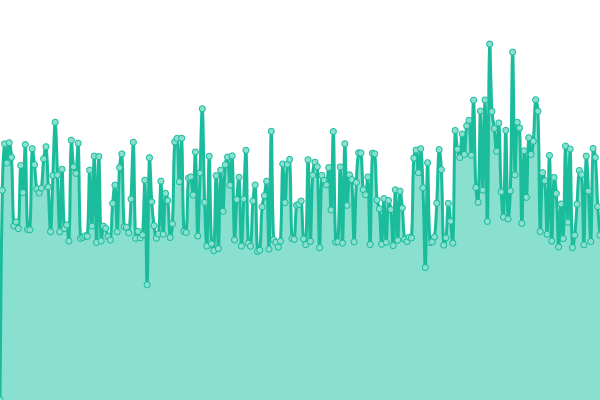
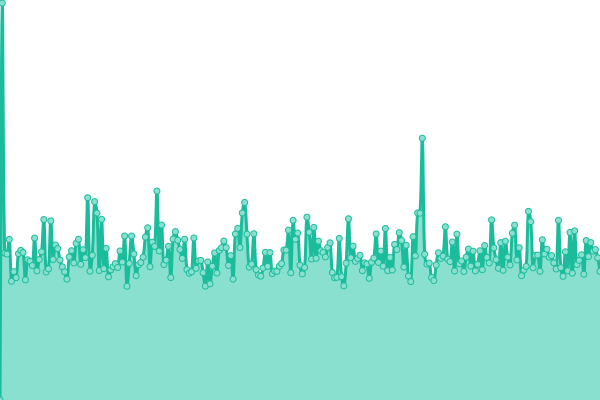

**DownTime-Score**


[]()
[]()

#

**DownTime-Score** is a Small project aimed to Monitor the performance and the availabillity of a variety of the Vital and Critical Moroccan Web Portals
That provides necessary WebBased digital services in order to Record incidents including **Services Outage**,**Network Disturbance** and **Possible CyberAttacks**
in-powered with upptime and uptime robot,
This small project is open source and you can find-out more **[Here](https://www.TebbaaX.com/hacking/dts.html)**.

UptimeRobot public APIs for th current Monitored WebServices :

```
https://www.dgssi.gov.ma == m788066273-1d3a0f4154118b9473496d36
http://covid19.interieur.gov.ma == m788066276-303228ba339d9023c6ed91a9
https://www.sante.gov.ma == m788066279-a48fa6e3341aaf5100c4f902
https://www.cnss.ma == m788066283-5b23c27a917a289728616ef0
http://data.gov.ma == m788066285-a42f9bdaf85ac2b18f630ed3
http://www.douane.gov.ma == m788066285-a42f9bdaf85ac2b18f630ed3
https://massar.men.gov.ma == m788066286-48244cc6ab91c44f6477a920
https://massarservice.men.gov.ma == m788066288-3a6790129d70b0b3bc52fc7f
https://portail.tax.gov.ma == m788066290-fcbec34345ad4b8ac656fa99
https://www.tgr.gov.ma == m788066294-069aa28682ddb4dcd60720ff
https://www.ancfcc.gov.ma == m788066295-7ad0ab68fae8f6ade078566a
https://rn.ae.gov.ma == m788066296-c8790cf6321b6a1ac1014cce
```

[]()
[]()
[]()
[]()
[]()
[]()
[]()
[]()
[]()
[]()
[]()
[]()

# [📈 Live Status](https://TebbaaX.github.io/DownTime-Score): <!--live status--> **🟧 Partial outage**

<!--start: status pages-->
<!-- This summary is generated by Upptime (https://github.com/upptime/upptime) -->
<!-- Do not edit this manually, your changes will be overwritten -->
<!-- prettier-ignore -->
| URL | Status | History | Response Time | Uptime |
| --- | ------ | ------- | ------------- | ------ |
|  [DGSSI](https://www.dgssi.gov.ma/) | 🟩 Up | [dgssi.yml](https://github.com/adnane-X-tebbaa/DownTime-Score/commits/HEAD/history/dgssi.yml) | <details><summary> 2130ms</summary><br><a href="https://TebbaaX.github.io/DownTime-Score/history/dgssi"></a><br><a href="https://TebbaaX.github.io/DownTime-Score/history/dgssi"></a><br><a href="https://TebbaaX.github.io/DownTime-Score/history/dgssi"></a><br><a href="https://TebbaaX.github.io/DownTime-Score/history/dgssi"></a><br><a href="https://TebbaaX.github.io/DownTime-Score/history/dgssi"></a></details> | <details><summary><a href="https://TebbaaX.github.io/DownTime-Score/history/dgssi">100.00%</a></summary><a href="https://TebbaaX.github.io/DownTime-Score/history/dgssi"></a><br><a href="https://TebbaaX.github.io/DownTime-Score/history/dgssi"></a><br><a href="https://TebbaaX.github.io/DownTime-Score/history/dgssi"></a><br><a href="https://TebbaaX.github.io/DownTime-Score/history/dgssi"></a><br><a href="https://TebbaaX.github.io/DownTime-Score/history/dgssi"></a></details>
|  [Covid Portal](http://covid19.interieur.gov.ma/Operation_ATTADAMON.aspx) | 🟩 Up | [covid-portal.yml](https://github.com/adnane-X-tebbaa/DownTime-Score/commits/HEAD/history/covid-portal.yml) | <details><summary> 4012ms</summary><br><a href="https://TebbaaX.github.io/DownTime-Score/history/covid-portal"></a><br><a href="https://TebbaaX.github.io/DownTime-Score/history/covid-portal"></a><br><a href="https://TebbaaX.github.io/DownTime-Score/history/covid-portal"></a><br><a href="https://TebbaaX.github.io/DownTime-Score/history/covid-portal"></a><br><a href="https://TebbaaX.github.io/DownTime-Score/history/covid-portal"></a></details> | <details><summary><a href="https://TebbaaX.github.io/DownTime-Score/history/covid-portal">35.87%</a></summary><a href="https://TebbaaX.github.io/DownTime-Score/history/covid-portal"></a><br><a href="https://TebbaaX.github.io/DownTime-Score/history/covid-portal"></a><br><a href="https://TebbaaX.github.io/DownTime-Score/history/covid-portal"></a><br><a href="https://TebbaaX.github.io/DownTime-Score/history/covid-portal"></a><br><a href="https://TebbaaX.github.io/DownTime-Score/history/covid-portal"></a></details>
|  [Health Portal](https://www.sante.gov.ma/Pages/Accueil.aspx) | 🟩 Up | [health-portal.yml](https://github.com/adnane-X-tebbaa/DownTime-Score/commits/HEAD/history/health-portal.yml) | <details><summary> 1924ms</summary><br><a href="https://TebbaaX.github.io/DownTime-Score/history/health-portal"></a><br><a href="https://TebbaaX.github.io/DownTime-Score/history/health-portal"></a><br><a href="https://TebbaaX.github.io/DownTime-Score/history/health-portal"></a><br><a href="https://TebbaaX.github.io/DownTime-Score/history/health-portal"></a><br><a href="https://TebbaaX.github.io/DownTime-Score/history/health-portal"></a></details> | <details><summary><a href="https://TebbaaX.github.io/DownTime-Score/history/health-portal">100.00%</a></summary><a href="https://TebbaaX.github.io/DownTime-Score/history/health-portal"></a><br><a href="https://TebbaaX.github.io/DownTime-Score/history/health-portal"></a><br><a href="https://TebbaaX.github.io/DownTime-Score/history/health-portal"></a><br><a href="https://TebbaaX.github.io/DownTime-Score/history/health-portal"></a><br><a href="https://TebbaaX.github.io/DownTime-Score/history/health-portal"></a></details>
|  [CNSS](https://www.cnss.ma) | 🟩 Up | [cnss.yml](https://github.com/adnane-X-tebbaa/DownTime-Score/commits/HEAD/history/cnss.yml) | <details><summary> 2279ms</summary><br><a href="https://TebbaaX.github.io/DownTime-Score/history/cnss"></a><br><a href="https://TebbaaX.github.io/DownTime-Score/history/cnss"></a><br><a href="https://TebbaaX.github.io/DownTime-Score/history/cnss"></a><br><a href="https://TebbaaX.github.io/DownTime-Score/history/cnss"></a><br><a href="https://TebbaaX.github.io/DownTime-Score/history/cnss"></a></details> | <details><summary><a href="https://TebbaaX.github.io/DownTime-Score/history/cnss">59.36%</a></summary><a href="https://TebbaaX.github.io/DownTime-Score/history/cnss"></a><br><a href="https://TebbaaX.github.io/DownTime-Score/history/cnss"></a><br><a href="https://TebbaaX.github.io/DownTime-Score/history/cnss"></a><br><a href="https://TebbaaX.github.io/DownTime-Score/history/cnss"></a><br><a href="https://TebbaaX.github.io/DownTime-Score/history/cnss"></a></details>
|  [Data](http://data.gov.ma) | 🟩 Up | [data.yml](https://github.com/adnane-X-tebbaa/DownTime-Score/commits/HEAD/history/data.yml) | <details><summary> 2559ms</summary><br><a href="https://TebbaaX.github.io/DownTime-Score/history/data"></a><br><a href="https://TebbaaX.github.io/DownTime-Score/history/data"></a><br><a href="https://TebbaaX.github.io/DownTime-Score/history/data"></a><br><a href="https://TebbaaX.github.io/DownTime-Score/history/data"></a><br><a href="https://TebbaaX.github.io/DownTime-Score/history/data"></a></details> | <details><summary><a href="https://TebbaaX.github.io/DownTime-Score/history/data">99.76%</a></summary><a href="https://TebbaaX.github.io/DownTime-Score/history/data"></a><br><a href="https://TebbaaX.github.io/DownTime-Score/history/data"></a><br><a href="https://TebbaaX.github.io/DownTime-Score/history/data"></a><br><a href="https://TebbaaX.github.io/DownTime-Score/history/data"></a><br><a href="https://TebbaaX.github.io/DownTime-Score/history/data"></a></details>
|  [Douanes](http://www.douane.gov.ma) | 🟩 Up | [douanes.yml](https://github.com/adnane-X-tebbaa/DownTime-Score/commits/HEAD/history/douanes.yml) | <details><summary> 1940ms</summary><br><a href="https://TebbaaX.github.io/DownTime-Score/history/douanes"></a><br><a href="https://TebbaaX.github.io/DownTime-Score/history/douanes"></a><br><a href="https://TebbaaX.github.io/DownTime-Score/history/douanes"></a><br><a href="https://TebbaaX.github.io/DownTime-Score/history/douanes"></a><br><a href="https://TebbaaX.github.io/DownTime-Score/history/douanes"></a></details> | <details><summary><a href="https://TebbaaX.github.io/DownTime-Score/history/douanes">96.12%</a></summary><a href="https://TebbaaX.github.io/DownTime-Score/history/douanes"></a><br><a href="https://TebbaaX.github.io/DownTime-Score/history/douanes"></a><br><a href="https://TebbaaX.github.io/DownTime-Score/history/douanes"></a><br><a href="https://TebbaaX.github.io/DownTime-Score/history/douanes"></a><br><a href="https://TebbaaX.github.io/DownTime-Score/history/douanes"></a></details>
|  [Massar Website](https://massar.men.gov.ma) | 🟩 Up | [massar-website.yml](https://github.com/adnane-X-tebbaa/DownTime-Score/commits/HEAD/history/massar-website.yml) | <details><summary> 2167ms</summary><br><a href="https://TebbaaX.github.io/DownTime-Score/history/massar-website"></a><br><a href="https://TebbaaX.github.io/DownTime-Score/history/massar-website"></a><br><a href="https://TebbaaX.github.io/DownTime-Score/history/massar-website"></a><br><a href="https://TebbaaX.github.io/DownTime-Score/history/massar-website"></a><br><a href="https://TebbaaX.github.io/DownTime-Score/history/massar-website"></a></details> | <details><summary><a href="https://TebbaaX.github.io/DownTime-Score/history/massar-website">49.73%</a></summary><a href="https://TebbaaX.github.io/DownTime-Score/history/massar-website"></a><br><a href="https://TebbaaX.github.io/DownTime-Score/history/massar-website"></a><br><a href="https://TebbaaX.github.io/DownTime-Score/history/massar-website"></a><br><a href="https://TebbaaX.github.io/DownTime-Score/history/massar-website"></a><br><a href="https://TebbaaX.github.io/DownTime-Score/history/massar-website"></a></details>
|  [Massar Login](https://massarservice.men.gov.ma/moutamadris/Account) | 🟩 Up | [massar-login.yml](https://github.com/adnane-X-tebbaa/DownTime-Score/commits/HEAD/history/massar-login.yml) | <details><summary> 1380ms</summary><br><a href="https://TebbaaX.github.io/DownTime-Score/history/massar-login"></a><br><a href="https://TebbaaX.github.io/DownTime-Score/history/massar-login"></a><br><a href="https://TebbaaX.github.io/DownTime-Score/history/massar-login"></a><br><a href="https://TebbaaX.github.io/DownTime-Score/history/massar-login"></a><br><a href="https://TebbaaX.github.io/DownTime-Score/history/massar-login"></a></details> | <details><summary><a href="https://TebbaaX.github.io/DownTime-Score/history/massar-login">100.00%</a></summary><a href="https://TebbaaX.github.io/DownTime-Score/history/massar-login"></a><br><a href="https://TebbaaX.github.io/DownTime-Score/history/massar-login"></a><br><a href="https://TebbaaX.github.io/DownTime-Score/history/massar-login"></a><br><a href="https://TebbaaX.github.io/DownTime-Score/history/massar-login"></a><br><a href="https://TebbaaX.github.io/DownTime-Score/history/massar-login"></a></details>
|  [Tax Portal](https://portail.tax.gov.ma) | 🟩 Up | [tax-portal.yml](https://github.com/adnane-X-tebbaa/DownTime-Score/commits/HEAD/history/tax-portal.yml) | <details><summary> 3059ms</summary><br><a href="https://TebbaaX.github.io/DownTime-Score/history/tax-portal"></a><br><a href="https://TebbaaX.github.io/DownTime-Score/history/tax-portal"></a><br><a href="https://TebbaaX.github.io/DownTime-Score/history/tax-portal"></a><br><a href="https://TebbaaX.github.io/DownTime-Score/history/tax-portal"></a><br><a href="https://TebbaaX.github.io/DownTime-Score/history/tax-portal"></a></details> | <details><summary><a href="https://TebbaaX.github.io/DownTime-Score/history/tax-portal">100.00%</a></summary><a href="https://TebbaaX.github.io/DownTime-Score/history/tax-portal"></a><br><a href="https://TebbaaX.github.io/DownTime-Score/history/tax-portal"></a><br><a href="https://TebbaaX.github.io/DownTime-Score/history/tax-portal"></a><br><a href="https://TebbaaX.github.io/DownTime-Score/history/tax-portal"></a><br><a href="https://TebbaaX.github.io/DownTime-Score/history/tax-portal"></a></details>
|  [ADA](https://www.ada.gov.ma/web) | 🟥 Down | [ada.yml](https://github.com/adnane-X-tebbaa/DownTime-Score/commits/HEAD/history/ada.yml) | <details><summary> 2961ms</summary><br><a href="https://TebbaaX.github.io/DownTime-Score/history/ada"></a><br><a href="https://TebbaaX.github.io/DownTime-Score/history/ada"></a><br><a href="https://TebbaaX.github.io/DownTime-Score/history/ada"></a><br><a href="https://TebbaaX.github.io/DownTime-Score/history/ada"></a><br><a href="https://TebbaaX.github.io/DownTime-Score/history/ada"></a></details> | <details><summary><a href="https://TebbaaX.github.io/DownTime-Score/history/ada">100.00%</a></summary><a href="https://TebbaaX.github.io/DownTime-Score/history/ada"></a><br><a href="https://TebbaaX.github.io/DownTime-Score/history/ada"></a><br><a href="https://TebbaaX.github.io/DownTime-Score/history/ada"></a><br><a href="https://TebbaaX.github.io/DownTime-Score/history/ada"></a><br><a href="https://TebbaaX.github.io/DownTime-Score/history/ada"></a></details>
|  [TGR Portal](https://www.tgr.gov.ma/wps/portal) | 🟩 Up | [tgr-portal.yml](https://github.com/adnane-X-tebbaa/DownTime-Score/commits/HEAD/history/tgr-portal.yml) | <details><summary> 1324ms</summary><br><a href="https://TebbaaX.github.io/DownTime-Score/history/tgr-portal"></a><br><a href="https://TebbaaX.github.io/DownTime-Score/history/tgr-portal"></a><br><a href="https://TebbaaX.github.io/DownTime-Score/history/tgr-portal"></a><br><a href="https://TebbaaX.github.io/DownTime-Score/history/tgr-portal"></a><br><a href="https://TebbaaX.github.io/DownTime-Score/history/tgr-portal"></a></details> | <details><summary><a href="https://TebbaaX.github.io/DownTime-Score/history/tgr-portal">0.00%</a></summary><a href="https://TebbaaX.github.io/DownTime-Score/history/tgr-portal"></a><br><a href="https://TebbaaX.github.io/DownTime-Score/history/tgr-portal"></a><br><a href="https://TebbaaX.github.io/DownTime-Score/history/tgr-portal"></a><br><a href="https://TebbaaX.github.io/DownTime-Score/history/tgr-portal"></a><br><a href="https://TebbaaX.github.io/DownTime-Score/history/tgr-portal"></a></details>
|  [ANCFCC](https://www.ancfcc.gov.ma/Publications) | 🟥 Down | [ancfcc.yml](https://github.com/adnane-X-tebbaa/DownTime-Score/commits/HEAD/history/ancfcc.yml) | <details><summary> 0ms</summary><br><a href="https://TebbaaX.github.io/DownTime-Score/history/ancfcc"></a><br><a href="https://TebbaaX.github.io/DownTime-Score/history/ancfcc"></a><br><a href="https://TebbaaX.github.io/DownTime-Score/history/ancfcc"></a><br><a href="https://TebbaaX.github.io/DownTime-Score/history/ancfcc"></a><br><a href="https://TebbaaX.github.io/DownTime-Score/history/ancfcc"></a></details> | <details><summary><a href="https://TebbaaX.github.io/DownTime-Score/history/ancfcc">100.00%</a></summary><a href="https://TebbaaX.github.io/DownTime-Score/history/ancfcc"></a><br><a href="https://TebbaaX.github.io/DownTime-Score/history/ancfcc"></a><br><a href="https://TebbaaX.github.io/DownTime-Score/history/ancfcc"></a><br><a href="https://TebbaaX.github.io/DownTime-Score/history/ancfcc"></a><br><a href="https://TebbaaX.github.io/DownTime-Score/history/ancfcc"></a></details>
|  [Auto-E Portal](https://rn.ae.gov.ma/login) | 🟥 Down | [auto-e-portal.yml](https://github.com/adnane-X-tebbaa/DownTime-Score/commits/HEAD/history/auto-e-portal.yml) | <details><summary> 0ms</summary><br><a href="https://TebbaaX.github.io/DownTime-Score/history/auto-e-portal"></a><br><a href="https://TebbaaX.github.io/DownTime-Score/history/auto-e-portal"></a><br><a href="https://TebbaaX.github.io/DownTime-Score/history/auto-e-portal"></a><br><a href="https://TebbaaX.github.io/DownTime-Score/history/auto-e-portal"></a><br><a href="https://TebbaaX.github.io/DownTime-Score/history/auto-e-portal"></a></details> | <details><summary><a href="https://TebbaaX.github.io/DownTime-Score/history/auto-e-portal">100.00%</a></summary><a href="https://TebbaaX.github.io/DownTime-Score/history/auto-e-portal"></a><br><a href="https://TebbaaX.github.io/DownTime-Score/history/auto-e-portal"></a><br><a href="https://TebbaaX.github.io/DownTime-Score/history/auto-e-portal"></a><br><a href="https://TebbaaX.github.io/DownTime-Score/history/auto-e-portal"></a><br><a href="https://TebbaaX.github.io/DownTime-Score/history/auto-e-portal"></a></details>

<!--end: status pages-->

## 📄 License

- Code: [MIT](./LICENSE) © [TebbaaX](https://www.TebbaaX.com)
- Data in the `./history` directory are under [Open Database License](https://opendatacommons.org/licenses/odbl/1-0/)
